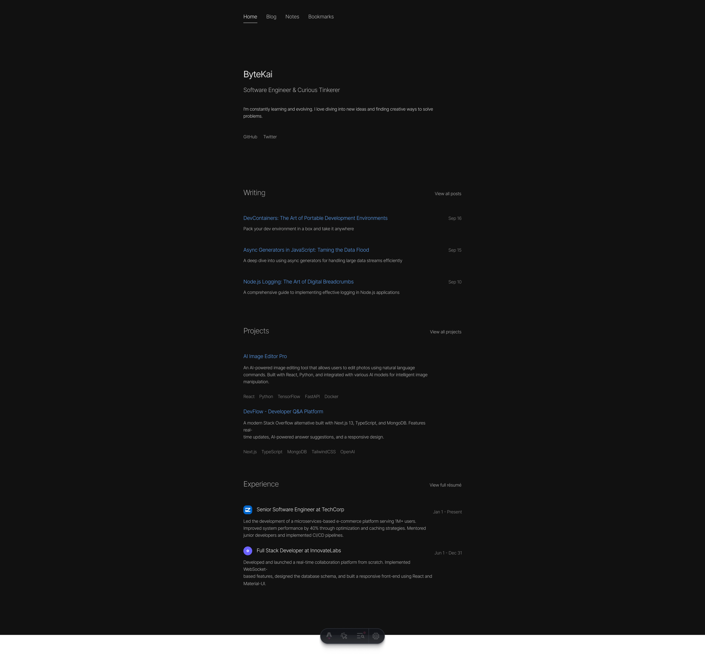

# Free Minimal Astro Portfolio

A modern, minimalist portfolio website built with Astro and deployed on Cloudflare Pages. Features a collection of writings, projects, and professional experiences.

## Overview

This is a personal portfolio website for ByteKai, a Software Engineer and Curious Tinkerer. The site showcases blog posts, technical notes, project work, and professional experience in a clean, fast-loading format.

## Features

- 🚀 Built with [Astro](https://astro.build) v5.1
- ⚡️ Deployed on [Cloudflare Pages](https://pages.cloudflare.com)
- 📝 Content sections:
  - Blog posts
  - Technical notes
  - Project showcase
  - Professional experience
  - Curated bookmarks
- 🎨 Clean typography with:
  - Inter
  - Roboto Mono
  - Source Sans Pro
- 🌐 Social presence integration
- 📱 Fully responsive design

## Tech Stack

- **Framework**: [Astro](https://astro.build) 5.1.2
- **Deployment**: Cloudflare Pages
- **Fonts**: 
  - @fontsource/inter
  - @fontsource/roboto-mono
  - @fontsource/source-sans-pro

## Development

### Prerequisites

- Node.js (Latest LTS version recommended)
- npm or pnpm

### Local Development

1. Clone the repository
2. Run `pnpm install` to install dependencies
3. Run `pnpm dev` to start the development server
4. Open your browser and navigate to `http://localhost:4321` to view the site

## License

This project is licensed under the Apache License 2.0 - see the [LICENSE](LICENSE) file for details.

## Acknowledgments

- [Astro](https://astro.build)
- [Fontsource](https://fontsource.org)
- [Tailwind CSS](https://tailwindcss.com)

